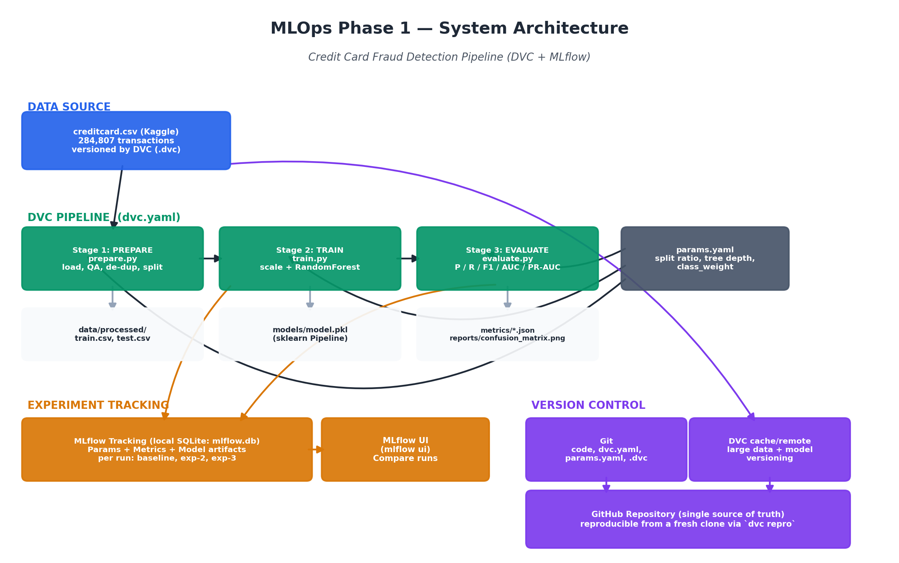
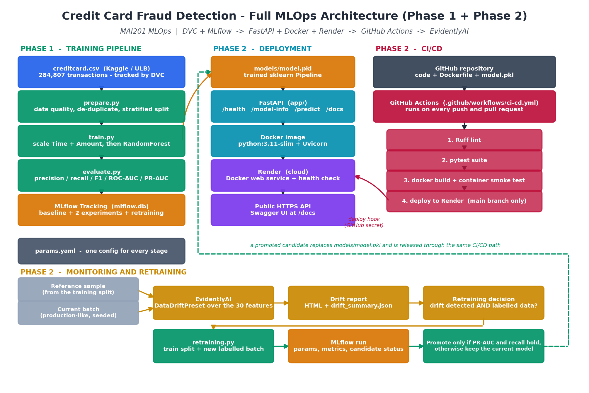

# Credit Card Fraud Detection — end-to-end MLOps (Phase 1 + Phase 2)

A Random Forest that flags fraudulent card transactions, taken all the way from
a versioned dataset to a monitored HTTP service running in the cloud.

**Phase 1** built the reproducible training side: a DVC pipeline
(`prepare → train → evaluate`) with MLflow experiment tracking.
**Phase 2** put that model into production: a FastAPI service, a Docker image,
a deployment on Render, CI/CD through GitHub Actions, drift monitoring with
EvidentlyAI, and a retraining workflow.

The dataset is severely imbalanced — only **0.17%** of transactions are fraud —
so everything is built around that: stratified splitting,
`class_weight="balanced"`, and precision / recall / F1 / ROC-AUC / PR-AUC
instead of plain accuracy.

**Live API:** https://mai201-fraud-api.onrender.com
**Swagger UI:** https://mai201-fraud-api.onrender.com/docs
**Health:** https://mai201-fraud-api.onrender.com/health

> The service runs on Render's free plan, which sleeps when idle. The first
> request after a quiet period can take 30-60 seconds while the container wakes
> up; requests after that are fast.

---

## Team

| Name | Role | Phase 2 work |
|---|---|---|
| Abdulraouf Zabalawi | Project Lead & ML Lead | FastAPI endpoint, Model Card, MLflow integration |
| Mohamed Roble | Engineering Lead | Docker, cloud deployment, GitHub Actions CI/CD |
| Someyah Balashi | Documentation Lead | EvidentlyAI drift reports, retraining script, presentation |

---

## 1. Requirement → deliverable map

### Phase 1

| Requirement | Where it lives |
|---|---|
| Dataset selection + documentation | [`docs/dataset_report.md`](docs/dataset_report.md), generated [`metrics/data_quality_report.json`](metrics/data_quality_report.json) |
| System architecture diagram | [`docs/architecture.png`](docs/architecture.png) |
| DVC pipeline with 3+ stages | [`dvc.yaml`](dvc.yaml) → `prepare`, `train`, `evaluate` |
| MLflow tracking: baseline + 2 experiments | [`run_experiments.sh`](run_experiments.sh), logged to `mlflow.db` |
| DVC + MLflow evidence | [`docs/evidence/`](docs/evidence/) |

### Phase 2

| Requirement | Where it lives |
|---|---|
| FastAPI endpoint | [`app/`](app/) — `main.py`, `schemas.py`, `model_service.py` |
| Docker container | [`Dockerfile`](Dockerfile), [`.dockerignore`](.dockerignore) |
| Cloud deployment | Render, described by [`render.yaml`](render.yaml) — https://mai201-fraud-api.onrender.com |
| CI/CD with tests, linting, auto-deploy | [`.github/workflows/ci-cd.yml`](.github/workflows/ci-cd.yml) |
| Automated tests | [`tests/`](tests/) — 34 tests |
| Linting | Ruff, configured in [`pyproject.toml`](pyproject.toml) |
| Drift detection (EvidentlyAI) | [`monitoring/drift.py`](monitoring/drift.py) |
| Generated drift reports | [`monitoring/reports/`](monitoring/reports/) |
| Retraining | [`monitoring/retraining.py`](monitoring/retraining.py) |
| Model Card | [`MODEL_CARD.md`](MODEL_CARD.md) |
| Phase 2 architecture diagram | [`docs/architecture_phase2.png`](docs/architecture_phase2.png) |
| Presentation + demo | [`presentation/`](presentation/) |

---

## 2. Project structure

```
mlops-creditcard/
├── README.md                       <- you are here
├── MODEL_CARD.md                   <- what the model is and is not for
├── params.yaml                     <- single source of truth for all settings
├── dvc.yaml / dvc.lock             <- 3-stage pipeline definition + lock
├── requirements.txt                <- full project stack
├── requirements-api.txt            <- serving deps only (goes into the image)
├── requirements-dev.txt            <- what CI installs to lint and test
├── pyproject.toml                  <- Ruff + pytest configuration
├── Dockerfile / .dockerignore      <- container for the API
├── render.yaml                     <- Render service as code
│
├── src/                            <- Phase 1 pipeline
│   ├── utils.py                    <- params loading, logging
│   ├── prepare.py                  <- stage 1: QA, de-duplicate, stratified split
│   ├── train.py                    <- stage 2: scale + RandomForest, log to MLflow
│   ├── evaluate.py                 <- stage 3: imbalance-aware metrics
│   └── export_serving_assets.py    <- real example transactions for /docs and the demo
│
├── app/                            <- Phase 2 API
│   ├── main.py                     <- FastAPI app and routes
│   ├── schemas.py                  <- Pydantic request/response models
│   ├── model_service.py            <- loads model.pkl once, runs predictions
│   └── example_transaction.json    <- real row shown in Swagger
│
├── monitoring/                     <- Phase 2 monitoring and retraining
│   ├── generate_drift_data.py      <- builds reference + current batches
│   ├── drift.py                    <- EvidentlyAI drift detection
│   ├── retraining.py               <- drift-triggered retraining with promotion rules
│   ├── data/                       <- the batches (committed, ~13 MB)
│   └── reports/                    <- generated HTML + JSON reports
│
├── tests/                          <- pytest suite
│   ├── test_api.py                 <- routes, validation, error paths
│   ├── test_model_service.py       <- loading, inference, thresholds
│   └── test_monitoring.py          <- drift detection and retraining guards
│
├── .github/workflows/ci-cd.yml     <- lint → test → docker → deploy
│
├── data/
│   ├── raw/creditcard.csv(.dvc)    <- DVC-tracked dataset
│   └── processed/{train,test}.csv  <- generated splits
├── models/model.pkl                <- trained sklearn Pipeline (1.9 MB, in Git)
├── metrics/                        <- data quality + train + eval metrics
├── reports/                        <- confusion matrix, classification report
├── docs/                           <- dataset report, architecture diagrams, evidence
└── presentation/                   <- final deck, demo script, sample requests
```

---

## 3. The dataset

**Credit Card Fraud Detection** (Kaggle / ULB) — 284,807 transactions from
European cardholders over two days in September 2013. 30 numeric features
(`Time`, `V1..V28` PCA components, `Amount`) and a binary target `Class`.

| Property | Value |
|---|---|
| Rows / columns | 284,807 / 31 |
| Missing values | 0 |
| Duplicate rows | 1,081 (removed in `prepare`) |
| Fraud / legitimate | 492 / 284,315 |
| Fraud rate | 0.1727% |

After de-duplication: 283,726 rows, split 80/20 with stratification into
**226,980 training rows (378 fraud)** and **56,746 test rows (95 fraud)**.

Full documentation is in [`docs/dataset_report.md`](docs/dataset_report.md).
The raw CSV is pinned by `data/raw/creditcard.csv.dvc`
(md5 `e90efcb83d69faf99fcab8b0255024de`, 150,828,752 bytes).

---

## 4. Architecture

Phase 1 only:



The complete Phase 1 + Phase 2 system — training, serving, CI/CD and the
monitoring loop:



Both diagrams are generated by scripts, so they can be regenerated when the
system changes:

```bash
python docs/generate_architecture_diagram.py
python docs/generate_phase2_architecture_diagram.py
```

---

## 5. Phase 1 — the DVC pipeline

Defined in [`dvc.yaml`](dvc.yaml), driven by [`params.yaml`](params.yaml):

1. **`prepare`** (`src/prepare.py`) — loads the raw CSV, writes a data-quality
   assessment, removes 1,081 duplicate transactions, and performs a
   **stratified** train/test split so the 0.17% fraud class is preserved in
   both halves.

2. **`train`** (`src/train.py`) — builds a scikit-learn `Pipeline` that scales
   only `Time` and `Amount` (inside the pipeline, so it is fit on training rows
   only and there is no leakage) and trains a `RandomForestClassifier` with
   `class_weight="balanced"`. Logs params, metrics and the model to MLflow.

3. **`evaluate`** (`src/evaluate.py`) — scores the held-out test set with
   precision, recall, F1, ROC-AUC and PR-AUC, plus a confusion matrix.

Each stage declares explicit `deps` / `outs` / `params`, so `dvc repro` re-runs
only what actually changed.

```bash
dvc repro          # run the pipeline
dvc dag            # show the stage graph
dvc metrics show   # train + eval metrics
```

### Baseline results

Measured on the held-out test set (56,746 transactions, 95 fraud):

| Metric | Value |
|---|---|
| Accuracy | 0.999383 |
| Precision | 0.8846 |
| Recall | 0.7263 |
| F1 | 0.7977 |
| ROC-AUC | 0.9567 |
| PR-AUC | 0.7854 |

Confusion matrix: 56,642 true negatives, 9 false positives, 26 false negatives,
69 true positives. The model catches 69 of the 95 frauds and raises 9 false
alarms out of 56,651 legitimate transactions.

---

## 6. MLflow experiment tracking

Backend: local SQLite (`sqlite:///mlflow.db`). Experiment name:
`creditcard-fraud-detection`.

```bash
./run_experiments.sh                                   # baseline + 2 experiments
dvc exp show                                           # compare
mlflow ui --backend-store-uri sqlite:///mlflow.db      # then open http://127.0.0.1:5000
```

Three configurations, scored on the held-out test set:

| Experiment | n_estimators | max_depth | class_weight | precision | recall | f1 | roc_auc | pr_auc |
|---|---|---|---|---|---|---|---|---|
| **baseline** | 100 | 12 | balanced | 0.885 | 0.726 | 0.798 | 0.957 | 0.785 |
| **exp-more-trees-deeper** | 150 | 16 | balanced | 0.932 | 0.726 | 0.817 | 0.942 | 0.806 |
| **exp-no-class-weight** | 100 | 12 | None | 0.986 | 0.726 | 0.836 | 0.965 | 0.788 |

All three catch the same fraction of fraud (recall ≈ 0.73) but trade precision
differently. Removing class weighting makes the model very conservative about
flagging fraud, which is exactly the kind of trade-off experiment tracking is
meant to expose. We kept the balanced baseline: in a real fraud system the
choice depends on the cost of a missed fraud versus a false alarm, and the
balanced version keeps recall up without collapsing precision.

Phase 2 adds retraining runs to the same experiment, tagged `stage=retrain`.

---

## 7. Phase 2 — the FastAPI service

| Endpoint | Method | Purpose |
|---|---|---|
| `/` | GET | Service description |
| `/health` | GET | 200 when the model is loaded, 503 when it is not |
| `/model-info` | GET | Model type, feature count, hyperparameters, artifact hash |
| `/predict` | POST | Score one transaction |
| `/docs` | GET | Swagger UI |

The service loads `models/model.pkl` **once at startup** and reuses it. It
serves the whole scikit-learn `Pipeline`, not just the classifier, so the
`Time` / `Amount` scaling applied at inference is identical to training.

`/health` deliberately returns **503** when the model failed to load. A health
check that reports "healthy" while the service cannot score anything is worse
than no health check at all.

### Request schema

`POST /predict` takes exactly the 30 training features, as JSON:

```
Time    float   seconds since the first transaction in the dataset
V1..V28 float   anonymised PCA components
Amount  float   transaction value, must be >= 0
```

Validation is strict. A missing field, a wrong type, a negative `Amount`, or an
unexpected field (including `Class`, which must never be sent) all return
**422** with a message naming the offending field.

### Example prediction

A real fraudulent transaction from the project's own test split is kept at
[`presentation/sample_requests/fraud.json`](presentation/sample_requests/fraud.json):

```bash
curl -s -X POST https://mai201-fraud-api.onrender.com/predict \
  -H 'Content-Type: application/json' \
  -d @presentation/sample_requests/fraud.json
```

```json
{
  "predicted_class": 1,
  "label": "fraud",
  "fraud_probability": 0.969592,
  "decision_threshold": 0.5,
  "is_fraud": true,
  "model_version": "2.0.0"
}
```

The matching legitimate transaction
([`legitimate.json`](presentation/sample_requests/legitimate.json)) comes back
with `fraud_probability` 0.000235. Both payloads and their expected outputs
were exported from the test split by `src/export_serving_assets.py` — they are
not made-up numbers.

### Running the API locally

```bash
pip install -r requirements.txt
uvicorn app.main:app --reload --port 8000
# http://127.0.0.1:8000/docs
```

`models/model.pkl` is committed, so this works straight from a clone. Set
`MODEL_PATH` to serve a different artifact, or `DECISION_THRESHOLD` to change
the 0.5 cut-off.

---

## 8. Docker

```bash
docker build -t fraud-api .
docker run --rm -p 8000:8000 fraud-api

curl http://localhost:8000/health
curl -X POST http://localhost:8000/predict \
  -H 'Content-Type: application/json' \
  -d @presentation/sample_requests/fraud.json
# http://localhost:8000/docs
```

The image starts from `python:3.11-slim` and installs only
`requirements-api.txt` — DVC, MLflow, Evidently, matplotlib and the test tools
stay out, because serving does not need them. It runs as a non-root user,
listens on `$PORT` (Render injects it; 8000 locally), and contains nothing but
code and the 1.9 MB model file. No secrets are baked in.

`requirements-api.txt` is fully pinned on purpose: `model.pkl` is a pickled
scikit-learn object, so the container has to install the same scikit-learn that
fitted it.

---

## 9. Cloud deployment (Render)

The service is deployed on **Render** as a Docker web service, described by
[`render.yaml`](render.yaml): free plan, `dockerfilePath: ./Dockerfile`, health
check path `/health`.

**Public API:** https://mai201-fraud-api.onrender.com
**Swagger UI:** https://mai201-fraud-api.onrender.com/docs
**Health:** https://mai201-fraud-api.onrender.com/health

Render's own auto-deploy is switched **off**. Deployments are triggered by the
GitHub Actions workflow through a deploy hook, and only after linting, the
tests and the container smoke test have passed — otherwise code that failed CI
could still reach production.

### Recreating the deployment

1. On Render: **New → Web Service**, connect this repository, choose the
   **Docker** runtime, set the health check path to `/health`, and turn
   auto-deploy off.
2. Copy the service's **deploy hook** URL from Settings → Deploy Hook.
3. In GitHub: **Settings → Secrets and variables → Actions**
   - add a secret `RENDER_DEPLOY_HOOK_URL` with that URL;
   - add a variable `PUBLIC_API_URL` with the service URL, so the workflow can
     verify the deployment afterwards.

The hook URL is a credential — it belongs in GitHub Secrets and nowhere else.
Nothing in this repository contains it.

---

## 10. Testing

```bash
pip install -r requirements-dev.txt
pytest -v
```

34 tests covering:

- every route, including `/docs` and `/openapi.json`
- `/health` reporting 200 with the model loaded, and 503 when it is not
- a valid prediction, and that the returned probability is the model's own
  output rather than anything the API post-processed
- the full response schema, and that the probability is between 0 and 1
- missing features, wrong types, negative amounts, unexpected fields, empty and
  malformed bodies — all expected to return 422
- model loading, checksums, threshold behaviour, and the error raised when
  predicting before a model is loaded
- Evidently flagging a shifted batch and not flagging an identical one
- the retraining guards: unlabelled batches and single-class batches are
  refused, and the promotion rules accept and reject correctly

Tests run against the **real** `models/model.pkl`. The only mocking is in one
test that deliberately breaks the model to check the 503 path.

---

## 11. Linting

```bash
ruff check .
```

Ruff is configured in [`pyproject.toml`](pyproject.toml): line length 100,
rules `E`, `F`, `W`, `I`, `B`, `UP`, `C4`, targeting Python 3.10. The whole
repository passes. There is one narrow per-file ignore, for `src/evaluate.py`,
which has to call `matplotlib.use("Agg")` before importing `pyplot` and so
cannot keep all its imports at the top.

---

## 12. CI/CD with GitHub Actions

[`.github/workflows/ci-cd.yml`](.github/workflows/ci-cd.yml) runs on every push
to `main`, every pull request against `main`, and on manual dispatch.

| Job | What it does |
|---|---|
| `lint-and-test` | Checks out, sets up Python 3.11 with a pip cache, installs `requirements-dev.txt`, runs `ruff check .`, runs `pytest -v` |
| `docker-build` | Builds the image, **starts the container**, waits for it to become healthy, asserts `/health` reports `model_loaded: true`, checks `/docs` is served, posts a real transaction to `/predict` and asserts the probability is in range, and sends a malformed body expecting a 422 |
| `deploy` | Only for pushes to `main`, and only after both jobs above pass. Calls the Render deploy hook from `secrets.RENDER_DEPLOY_HOOK_URL`, then polls `${{ vars.PUBLIC_API_URL }}/health` until the deployed service reports healthy |

Pull requests run linting, the tests and the container smoke test, but never
deploy.

---

## 13. Monitoring — EvidentlyAI drift detection

We use **EvidentlyAI 0.7.21** with `DataDriftPreset` over the 30 input
features. `Class` is excluded: the API never receives a label at prediction
time, so monitoring the target would say nothing about what production is
actually sending.

### Building the batches

```bash
python monitoring/generate_drift_data.py
```

This writes four files to `monitoring/data/`, all seeded and reproducible:

| File | Rows | What it is |
|---|---|---|
| `reference_sample.csv` | 10,000 | Sample of the **training** split — the distribution the model learned. Never modified. |
| `current_normal.csv` | 5,000 | Untouched rows from the **test** split — a healthy production day. |
| `current_drifted.csv` | 5,000 | The same rows with a deterministic shift applied to 17 of the 30 columns. |
| `labeled_batch.csv` | 5,000 | Shifted rows from the training split **with labels kept** — the input to retraining. |

`current_drifted.csv` and `labeled_batch.csv` are **simulated drift for
demonstration**. They are built by a reproducible transformation of real rows —
larger amounts, later timestamps, PCA components moved by a multiple of their
own standard deviation — and they are labelled as simulated in
`monitoring/data/manifest.json`. We have no real production traffic; presenting
this as real customer behaviour would be dishonest.

### Running the checks

```bash
# healthy batch — expect no dataset drift
python monitoring/drift.py --current monitoring/data/current_normal.csv --name reference

# simulated drift — expect dataset drift
python monitoring/drift.py --current monitoring/data/current_drifted.csv --name drift
```

### Generated reports

| Scenario | Report | Summary | Drifted columns | Dataset drift |
|---|---|---|---|---|
| Healthy batch | [`monitoring/reports/reference_report.html`](monitoring/reports/reference_report.html) | [`reference_summary.json`](monitoring/reports/reference_summary.json) | 0 / 30 (share 0.000) | No |
| Simulated drift | [`monitoring/reports/drift_report.html`](monitoring/reports/drift_report.html) | [`drift_summary.json`](monitoring/reports/drift_summary.json) | 17 / 30 (share 0.567) | Yes |

The 17 flagged columns are exactly the 17 the generator shifted. The healthy
run flagging zero matters as much as the drifted run flagging 17 — it shows the
monitor is not simply alarmed by everything.

Every number in the JSON summaries comes from the Evidently snapshot. Nothing
in them is typed by hand.

---

## 14. Retraining

```bash
# monitoring only, no training
python monitoring/retraining.py monitor --current monitoring/data/current_drifted.csv --name drift

# retrain from a newly labelled batch
python monitoring/retraining.py retrain --labeled-data monitoring/data/labeled_batch.csv
```

`retrain` will not run unless drift was detected — it reads
`monitoring/reports/drift_summary.json` first and stops if there is nothing to
react to. Pass `--skip-drift-check` to override that deliberately.

The workflow:

1. check the drift signal
2. validate the labelled batch — it must have a `Class` column and both classes
3. build the training frame as **original training split + new batch**
4. train a candidate with the same pipeline and the same `params.yaml`
   (a Random Forest stays a Random Forest)
5. score the candidate **and** the currently deployed model on the untouched
   test split
6. log parameters, both sets of metrics, the reason and the decision to MLflow
7. promote only if the acceptance criteria are met
8. otherwise keep the existing model, and leave the candidate aside for
   inspection

**Why a labelled batch is required.** The API only ever sees the 30 features.
Whether a transaction turned out to be fraud is confirmed later by a chargeback
or an analyst. Retraining on unlabelled production requests would mean training
on the model's own predictions, which just reinforces its mistakes. The script
refuses to do it.

**Acceptance criteria:** PR-AUC at least as good as the current model's, and
recall not down by more than 0.02. Both are adjustable
(`--min-pr-auc-gain`, `--max-recall-drop`).

**The demonstration run** promoted its candidate:

| Metric | Deployed | Candidate |
|---|---|---|
| Recall | 0.7263 | 0.7368 |
| F1 | 0.7977 | 0.8046 |
| PR-AUC | 0.7854 | 0.7865 |
| ROC-AUC | 0.9567 | 0.9594 |

The full record is in
[`monitoring/reports/retraining_summary.json`](monitoring/reports/retraining_summary.json)
and in MLflow under the run name `retrain_<timestamp>_promoted`.

> After that demonstration we restored the Phase 1 baseline as
> `models/model.pkl`, so the artifact that is deployed, the one recorded in
> `dvc.lock`, and the one described in the Model Card are all the same model.
> Re-running the command above reproduces the promotion.

---

## 15. Model Card

[`MODEL_CARD.md`](MODEL_CARD.md) covers the model details, the training data,
the verified evaluation numbers, intended and out-of-scope use, limitations,
risks, fairness considerations, the monitoring and retraining policy, and how
to reproduce the artifact.

The short version: this is an academic demonstration. It misses 26 of the 95
frauds in the test set, its probabilities are not calibrated, and the dataset
carries no demographic attributes, so no fairness claim can be tested. It
should not make real financial decisions without proper validation, governance,
security review and operational controls.

---

## 16. Live demo

[`presentation/demo_script.md`](presentation/demo_script.md) has the exact
click-by-click demo, backup `curl` commands, what to do if the free-tier
service is cold, and the per-slide timing.

The deck is
[`presentation/MAI201_Phase2_Final_Presentation.pptx`](presentation/MAI201_Phase2_Final_Presentation.pptx) —
10 slides, roughly 8.5 minutes including a 1.5-minute demo, with all three team
members speaking and full speaker notes in the notes pane. It is generated by
`presentation/build_deck.js`, which reads the project's own metrics files, so it
can be rebuilt when a number changes:

```bash
cd presentation && npm install pptxgenjs && node build_deck.js
```

---

## 17. Setup from a fresh clone

```bash
git clone https://github.com/AZabalawi/MLops-credit-card-fraud.git
cd mlops-creditcard

python3 -m venv venv
source venv/bin/activate            # Windows: venv\Scripts\activate
pip install -r requirements.txt

# The API works immediately - models/model.pkl is in the repository:
uvicorn app.main:app --port 8000

# To retrain from scratch, download the dataset from Kaggle
# (https://www.kaggle.com/datasets/mlg-ulb/creditcardfraud), place it at
# data/raw/creditcard.csv, then:
dvc repro
```

Training takes roughly 1-3 minutes per run on ~227k rows. To change a setting,
edit `params.yaml` and re-run `dvc repro` — DVC re-runs only the affected
stages.

---

## 18. Notes on how the repository is set up

- **`models/model.pkl` is committed.** It is declared in `dvc.yaml` with
  `cache: false`, which keeps DVC tracking its hash in `dvc.lock` while leaving
  the file in Git. Render builds the image directly from GitHub, so the model
  has to be there at build time. At 1.9 MB that is a reasonable trade.
- **scikit-learn is pinned to 1.7.2**, not the 1.8.0 Phase 1 used. 1.8.0
  requires Python 3.11+, and more importantly the container has to load the
  pickle with the version that fitted it. Re-running the pipeline under 1.7.2
  reproduces five of the six Phase 1 metrics exactly; PR-AUC differs in the
  fourth decimal (0.7853 → 0.7854). That difference is recorded in the Model
  Card rather than smoothed over.
- **`monitoring/data/` is committed** (~13 MB of CSV) so the drift reports can
  be regenerated without downloading the Kaggle dataset first.
- **No DVC remote is configured.** `.dvc/config` is empty, so `dvc pull` will
  not fetch the raw CSV — it has to come from Kaggle. Adding a remote
  (`dvc remote add -d myremote <url>` then `dvc push`) would remove that step.
- **No secrets are in the repository.** The Render deploy hook lives in GitHub
  Actions secrets; `.env` files, keys and certificates are gitignored.

---

## 19. Phase 2 requirement checklist

| Requirement | Status | Evidence |
|---|---|---|
| Model deployed as a FastAPI endpoint | Done | [`app/`](app/), `/docs` on the live service |
| Containerised with Docker | Done | [`Dockerfile`](Dockerfile), built and smoke-tested in CI |
| Deployed to the cloud | Done | Render — https://mai201-fraud-api.onrender.com |
| CI/CD pipeline with GitHub Actions | Done | [`.github/workflows/ci-cd.yml`](.github/workflows/ci-cd.yml) |
| CI runs tests | Done | `pytest -v`, 34 tests |
| CI runs linting | Done | `ruff check .` |
| CI auto-deploys | Done | `deploy` job, `main` branch only, after CI passes |
| Monitoring implemented | Done | [`monitoring/drift.py`](monitoring/drift.py) |
| Drift detection with EvidentlyAI | Done | Evidently 0.7.21, `DataDriftPreset` |
| Retraining implemented | Done | [`monitoring/retraining.py`](monitoring/retraining.py) |
| Public API URL | Done | https://mai201-fraud-api.onrender.com |
| Drift reports delivered | Done | [`monitoring/reports/`](monitoring/reports/) |
| Model Card delivered | Done | [`MODEL_CARD.md`](MODEL_CARD.md) |
| Presentation slides delivered | Done | [`presentation/MAI201_Phase2_Final_Presentation.pptx`](presentation/MAI201_Phase2_Final_Presentation.pptx) |
| 7-10 minute presentation, all members speak | Done | 10 slides, ~8.5 min, speaker notes per slide |
| Live demo | Done | [`presentation/demo_script.md`](presentation/demo_script.md) |
